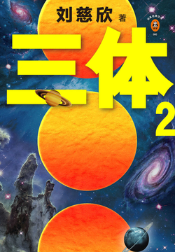

# JavaScript 仿 flash 轮播图

## 效果展示

1. 页面截图


2. 相关效果


## html 页面

从微信读书上找了几张书籍封面来做轮播的图片。

index.html

```html
<body>
    <div id="container">
        <div class="big_pic_div">
            <div class="prev"></div>
            <div class="next"></div>
            <a href="javascript:;" class="mark_left"></a>
            <a href="javascript:;" class="mark_right"></a>

            <div class="big_pic" style="z-index: 1;"></div>
            <div class="big_pic"></div>
            <div class="big_pic"></div>
            <div class="big_pic"></div>
            <div class="big_pic"></div>
            <div class="big_pic"></div>
        </div>

        <div class="small_pic_div">
            <div class="small_pic" style="filter: opacity(100); opacity: 1;"></div>
            <div class="small_pic"></div>
            <div class="small_pic"></div>
            <div class="small_pic"></div>
            <div class="small_pic"></div>
            <div class="small_pic"></div>
        </div>
    </div>
</body>
```


## css 样式

grid 布局的 gap 不兼容 IE，惹不起。

style.css

```css
body {
    margin: 0;
    padding: 0;
    background: skyblue;
}

#container {
    position: relative;
    overflow: hidden;
    width: 350px;
    height: 390px;
    margin: 50px auto 0;
    padding: 0 15px;
    background: goldenrod;
    box-shadow: 2px 1px 5px 1px #666;
}

.mark_left {
    position: absolute;
    left: 0;
    z-index: 3000;
    width: 65px;
    height: 360px;
}

.mark_right {
    position: absolute;
    right: 0;
    z-index: 3000;
    width: 65px;
    height: 360px;
}

.prev {
    position: absolute;
    top: 150px;
    left: 5px;
    z-index: 3001;
    width: 60px;
    height: 60px;
    background: url(img/btn.gif) olivedrab;
    /* transform: translateY(50%); */
    /* alpha 兼容IE8及以下的IE浏览器 */
    filter: alpha(opacity=0);
    opacity: 0;
}

.next {
    position: absolute;
    top: 120px;
    right: 5px;
    z-index: 3001;
    width: 60px;
    height: 60px;
    background: url(img/btn.gif) olivedrab;
    background-position-y: 60px;
    transform: translateY(50%);
    filter: alpha(opacity=0);
    opacity: 0;
}

.big_pic_div {
    position: relative;
    width: 250px;
    height: 360px;
    padding: 15px 0;
}

.big_pic {
    position: absolute;
    /* height 从 0 到 360px 下滑 */
    overflow: hidden;
    height: 360px;
    box-shadow: 1px 1px 2px #777;
}

.small_pic_div {
    display: grid;
    grid-template: repeat(6, 110px) / 80px;
    gap: 15px;
    position: absolute;
    top: 0;
    left: 273px;
    padding: 15px 0;
}

.small_pic {
    height: 110px;
    filter: alpha(opacity = 60);
    opacity: 0.6;
}

.small_pic img {
    width: 80px;
    height: 100%;
}
```


## JavaScript 实现

### 多物体运动框架

move.js

```javascript
// 获取样式
function getStyle(obj, name) {
    if (obj.currentStyle) {
        // IE...
        return obj.currentStyle[name];
    } else {
        // Chrome...
        return getComputedStyle(obj, false)[name];
    }
}

function startMove(obj, attr, target) {
    clearInterval(obj.timer);

    obj.timer = setInterval(function () {
        var cur = 0;
				
      	// 透明度
        if (attr == 'opacity') {
            cur = Math.round(parseFloat(getStyle(obj, 'opacity')) * 100);
        } else {
            cur = parseInt(getStyle(obj, attr));
        }

      	// 缓冲运动，速度和距离成正比
        var speed = 0;
        speed = (target - cur) / 6;
      	// 1px 是最小的，1.9px 会被当做 1px;得把速度取整，不然并未真正到达目标值 target
        speed = speed > 0 ? Math.ceil(speed) : Math.floor(speed);

        if (cur == target) {
            clearInterval(obj.timer);
        } else {
          	// 透明度没有单位，单独考虑
            if (attr == 'opacity') {
                obj.style.filter = 'alpha(opacity = ' + (cur + speed) + ')';
                obj.style.opacity = (cur + speed) / 100;
            } else {
                obj.style[attr] = cur + speed + 'px';
            }
        }
    }, 30);

}
```

### 轮播图功能实现

```javascript
window.onload = function () {
    var markLeft = document.getElementsByClassName('mark_left')[0];
    var markRight = document.getElementsByClassName('mark_right')[0];
    var btnPrev = document.getElementsByClassName('prev')[0];
    var btnNext = document.getElementsByClassName('next')[0];
    var smallPicDiv = document.getElementsByClassName('small_pic_div')[0];
    var smallPic = document.getElementsByClassName('small_pic');
    var bigPic = document.getElementsByClassName('big_pic');
    var nowZIndex = 2;
    var now = 0;
    var container = document.getElementById('container');

    // 左右按钮透明度设置
    btnPrev.onmouseover = markLeft.onmouseover = function () {
        startMove(btnPrev, 'opacity', 100);
    };
    btnPrev.onmouseout = markLeft.onmouseout = function () {
        startMove(btnPrev, 'opacity', 0);
    };
    btnNext.onmouseover = markRight.onmouseover = function () {
        startMove(btnNext, 'opacity', 100);
    };
    btnNext.onmouseout = markRight.onmouseout = function () {
        startMove(btnNext, 'opacity', 0);
    };

    // 点击小图时，大图自动切换
    for (var i = 0; i < smallPic.length; i++) {

        smallPic[i].index = i;

        smallPic[i].onclick = function () {

            if (now == this.index) return;
            // 使用 now 来表示当前选择的小图，当前选中的小图再次点击时不会让大图下滑
            now = this.index;
            bigPic[this.index].style.zIndex = nowZIndex++;
            bigPic[this.index].style.height = 0;
            startMove(bigPic[this.index], 'height', 360);

            // 点击后其他小图变透明，当前选中的为不透明
            for (var i = 0; i < smallPic.length; i++) {
                startMove(smallPic[i], 'opacity', 60);
            }
            startMove(smallPic[this.index], 'opacity', 100);
        };

        // 鼠标移动到小图上时，淡入淡出
        smallPic[i].onmouseover = function () {
            startMove(this, 'opacity', 100);
        };
        smallPic[i].onmouseout = function () {
            if (now != this.index) {
                startMove(this, 'opacity', 60);
            }
        };

    }

    // tab 函数：当前选中图片不透明；图片下滑；小图区域的滚动
    function tab() {
        bigPic[now].style.zIndex = nowZIndex++;
        for (var i = 0; i < smallPic.length; i++) {
            startMove(smallPic[i], 'opacity', 60);
        }
        startMove(smallPic[now], 'opacity', 100);

        bigPic[now].style.height = 0;
        startMove(bigPic[now], 'height', 360);

        if (now == 0) {
            startMove(smallPicDiv, 'top', 0);
        } else if (now == smallPic.length - 1) {
            startMove(smallPicDiv, 'top', -(now - 2) * (smallPic[0].offsetHeight + 15));
        } else {
            startMove(smallPicDiv, 'top', -(now - 1) * (smallPic[0].offsetHeight + 15));
        }
    }

    // 左右按钮点击
    btnPrev.onclick = function () {
        now--;
        if (now == smallPic.length) {
            now = smallPic.length - 1;
        } else if (now < 0) {
            now = smallPic.length - 1;
            // return;
        }
        tab();
    };
    btnNext.onclick = function () {
        now++;
        if (now == smallPic.length) {
            now = 0;
        }
        tab();
    };
    var timer = setInterval(btnNext.onclick, 3000);
    container.onmouseover = function () {
        clearInterval(timer);
    };
    container.onmouseout = function () {
        timer = setInterval(btnNext.onclick, 3000);
    };
};
```


end...


